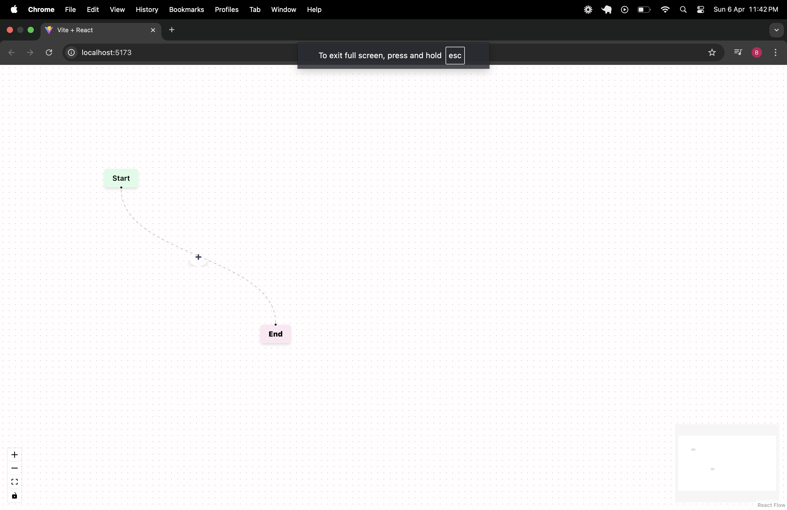
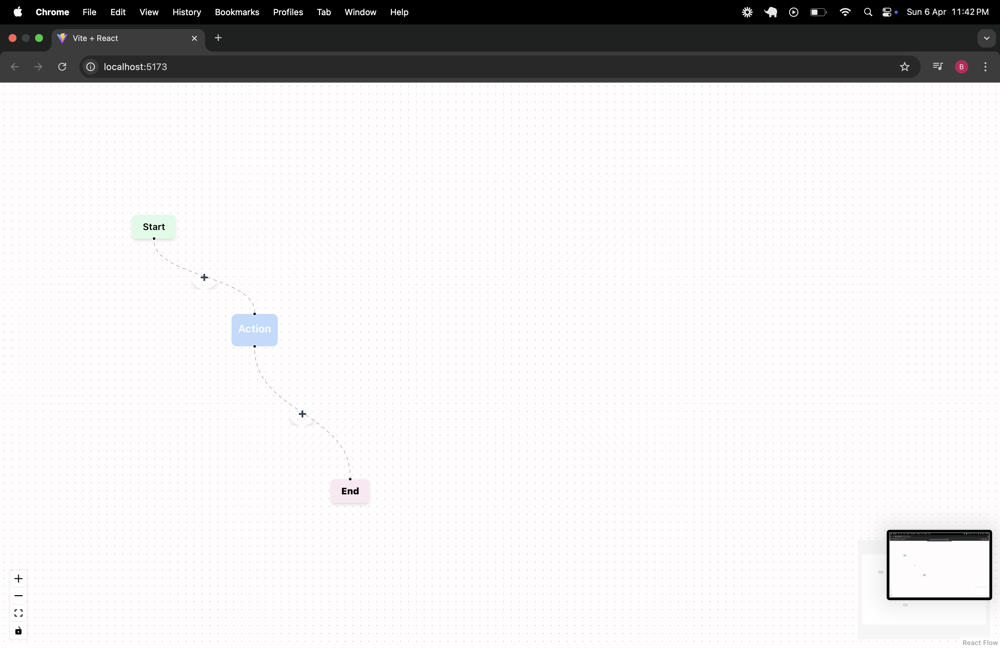
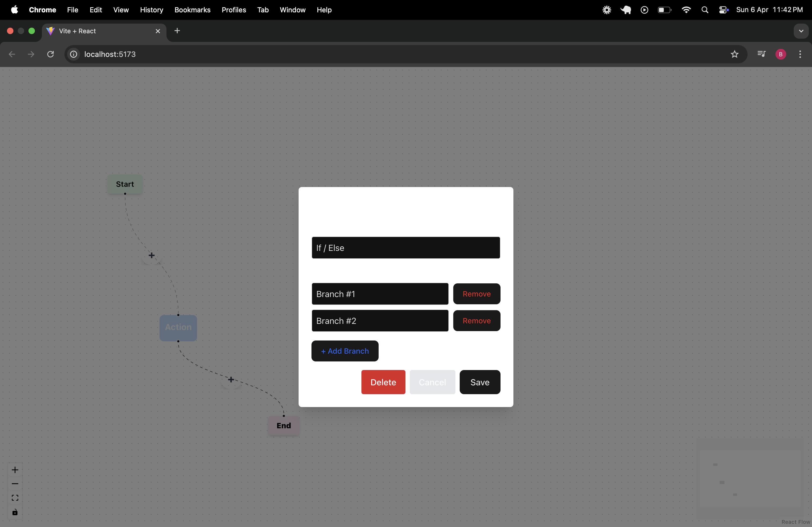
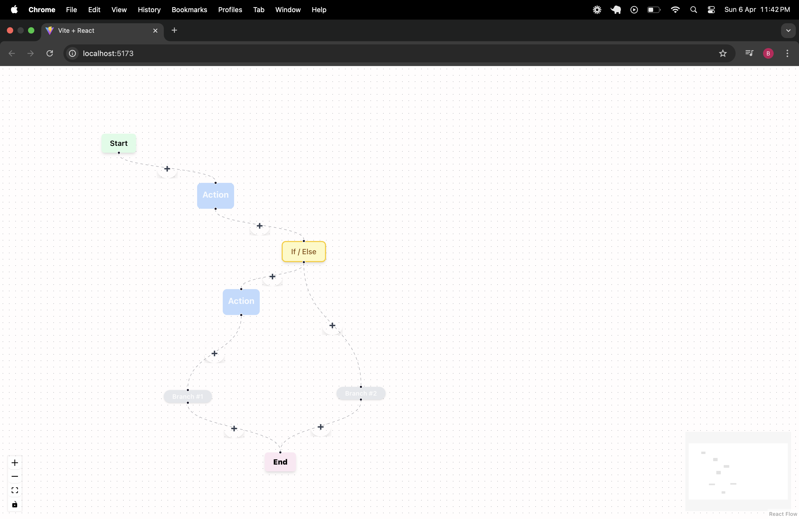
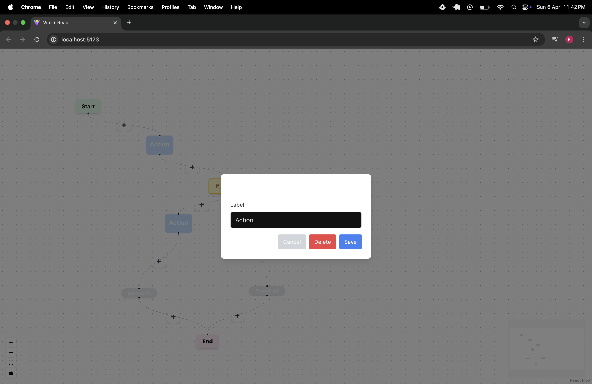
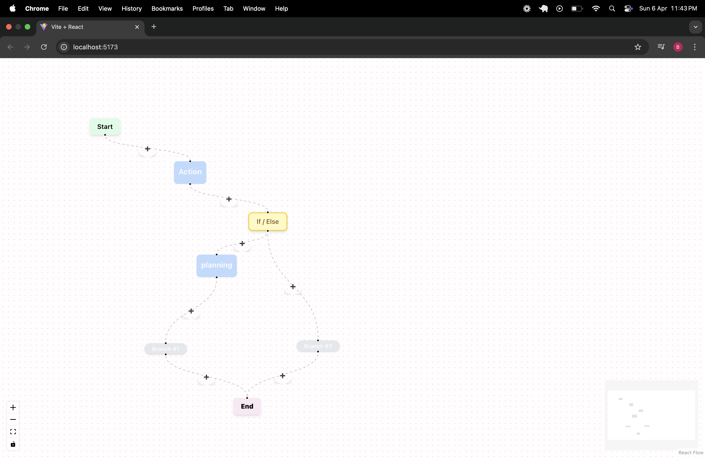

# React Flow Logic Builder

A visual drag-and-drop logic builder built with React Flow, allowing users to construct complex workflows with Start, Action, If/Else, and End nodes. Each node can be connected dynamically and edited in-place, with modal-driven UI and custom edges.

## Features

- Custom Nodes: Start, Action, End, If/Else, and BranchLabel

- Add Nodes Between Edges using a custom edge (+) button

- If/Else Structure with dynamic branching logic

- Modal Editing for both Action and If/Else nodes

- Custom Edge Logic with animated connectors

- Interactive UI: Drag, connect, edit, delete

- Built with Tailwind CSS for easy styling

## Preview

### Start Page

### Action Node

### If/Else Node

### Branch

### Rename

### Final Look

## Tech Stack

- React + Vite

- React Flow (via @xyflow/react)

- Tailwind CSS for styling

- Custom modals and edge component

## Setup

# Clone the repo

git clone https://github.com/your-username/react-flow-logic-builder.git
cd react-flow-logic-builder

# Install dependencies

npm install

# Start the dev server

npm run dev

## Usage

Click the (+) button on an edge to insert a node between two steps.

Choose Action or If/Else.

If selecting If/Else:

Configure branches in the modal.

Each branch spawns a branchlabel node.

Connect logic to branches and continue building.

Click any Action or If/Else node to edit/delete.
